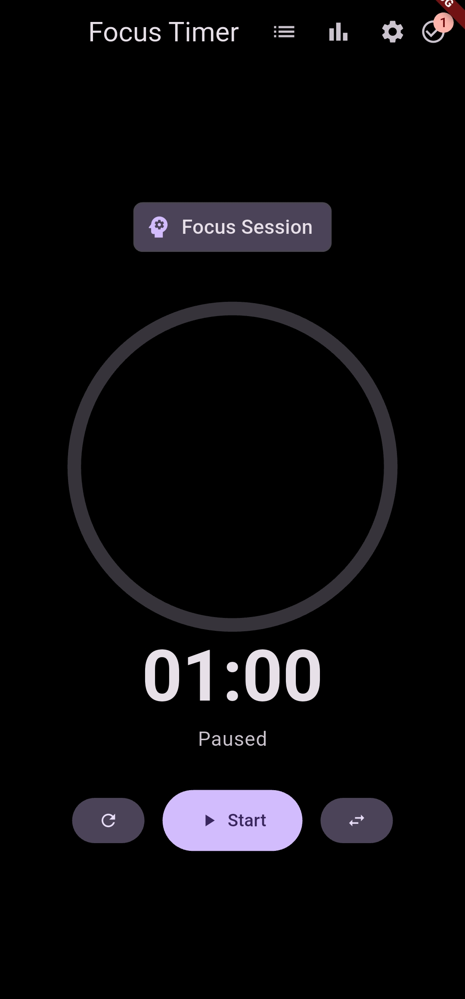
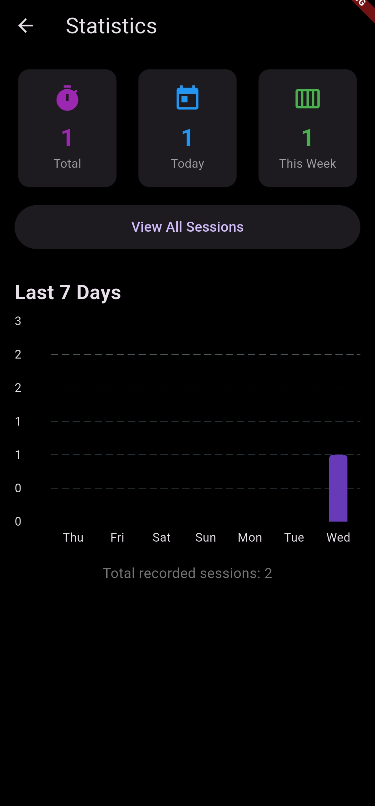
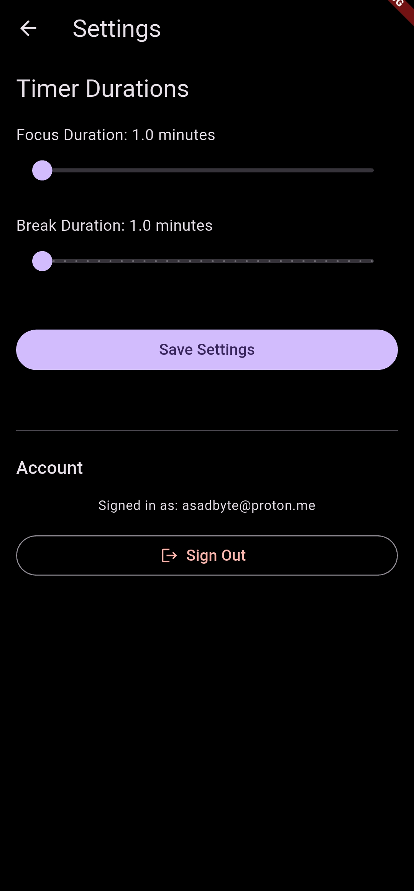

# Focus Timer


A modern and productive Focus Timer application built with Flutter, designed to help you manage your time effectively using the Pomodoro technique. It features seamless cloud synchronization, task management, and detailed statistics to track your productivity.

## ✨ Features

* **Focus & Break Timer**: Customizable timer for focus sessions and breaks with visual circular progress and audio notifications.
* **Task Management**: Create, manage, and complete tasks directly within the app to stay organized during your sessions.
* **Smart Statistics**: Visualize your productivity with weekly bar charts and track your daily, weekly, and total focus counts.
* **Session History**: Keep a detailed log of all your completed focus sessions.
* **Cloud Sync & Offline Support**: Seamlessly syncs data with Firebase Firestore. Includes a robust offline queue system that automatically syncs your data when internet connectivity is restored.
* **Customizable Settings**: Adjust focus and break durations to suit your personal workflow.
* **Theme Support**: Fully responsive Light and Dark modes.

## 📸 Screenshots

| Home (Timer)                                     | Statistics                                       |
| ------------------------------------------------ | ------------------------------------------------ |
|  |  |

| Session History                                  | Settings                                         |
| ------------------------------------------------ | ------------------------------------------------ |
|  |  |

## 🛠️ Technologies Used

This project is built with a robust Flutter ecosystem:

* **Flutter & Dart**: The core framework and language for cross-platform development.
* **Firebase**:
    * **Cloud Firestore**: For real-time cloud database storage.
    * **Firebase Auth**: For secure user authentication.
* **State Management**:
    * **Provider**: For efficient state management across the app.
* **Local Storage & Sync**:
    * **Hive**: For fast, local storage and offline data persistence.
    * **Connectivity Plus**: To detect network changes and trigger sync operations.
* **UI & Utilities**:
    * **Go Router**: For declarative routing and navigation.
    * **FL Chart**: To render beautiful statistical charts.
    * **AudioPlayers**: For playing timer completion sounds.

## 🚀 Getting Started

To get a local copy up and running, follow these simple steps.

### Prerequisites

* Flutter SDK installed (Version 3.9.2 or higher).
* An Android/iOS device or emulator.
* A Firebase project configured with `google-services.json` (Android) and `GoogleService-Info.plist` (iOS).

### Installation

1.  **Clone the repository:**
    ```sh
    git clone [https://github.com/asadbytes/focus-timer.git](https://github.com/asadbytes/focus-timer.git)
    ```
2.  **Install Dependencies:**
    Navigate to the project directory and run:
    ```sh
    flutter pub get
    ```
3.  **Run the app:**
    Connect your device and run:
    ```sh
    flutter run
    ```

## 🤝 Contributing

Contributions are what make the open-source community such an amazing place to learn, inspire, and create. Any contributions you make are **greatly appreciated**.

If you have a suggestion that would make this better, please fork the repo and create a pull request. You can also simply open an issue with the tag "enhancement".

1.  Fork the Project
2.  Create your Feature Branch (`git checkout -b feature/AmazingFeature`)
3.  Commit your Changes (`git commit -m 'Add some AmazingFeature'`)
4.  Push to the Branch (`git push origin feature/AmazingFeature`)
5.  Open a Pull Request

## 📄 License

Distributed under the MIT License. See `LICENSE` for more information.

---

<p align="center">
  Made with ❤️ by asadbytes
</p>